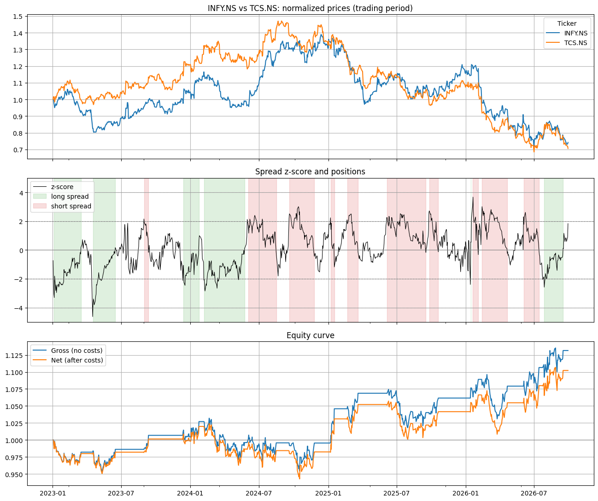
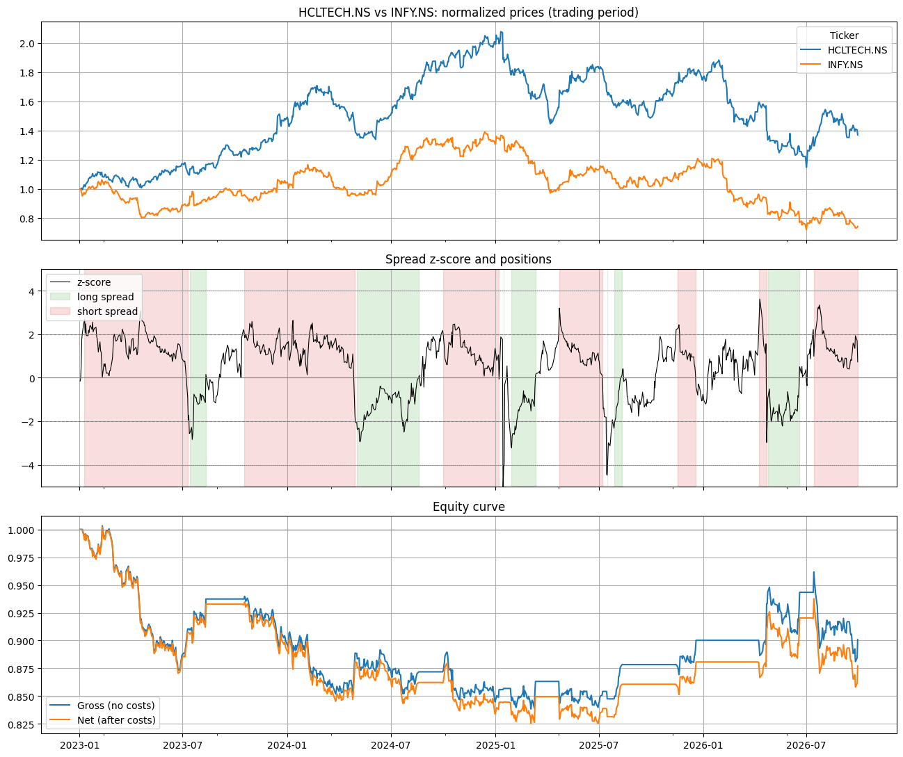
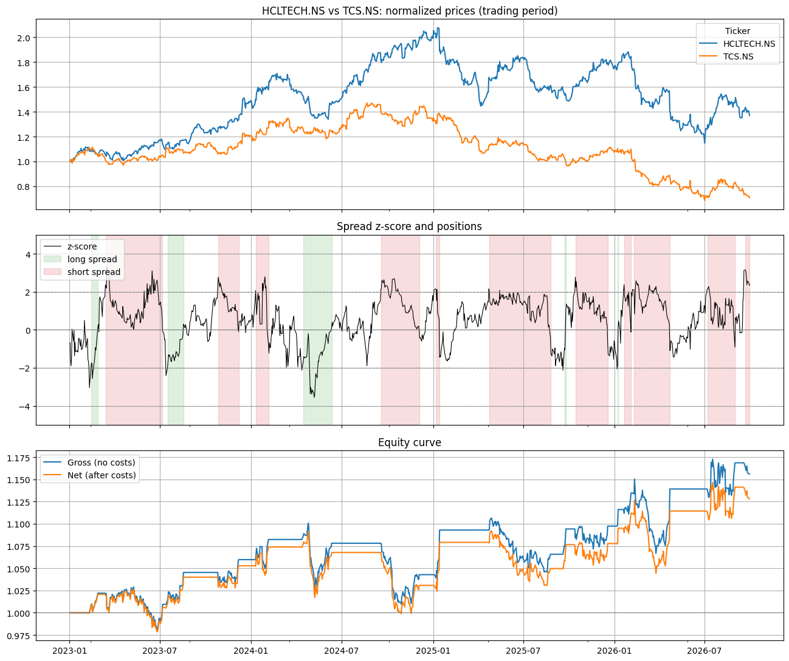
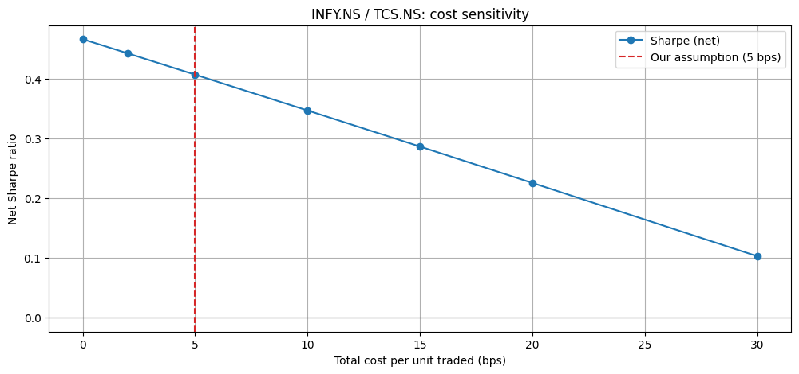
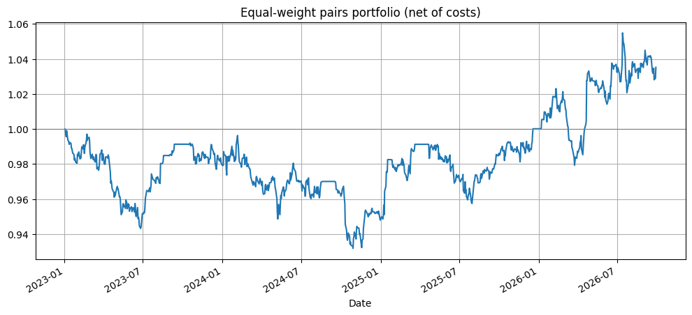
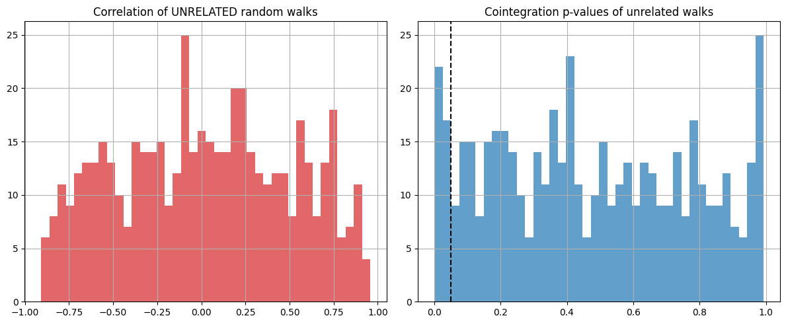

# Statistical Arbitrage Backtester: Pairs Trading with Cointegration


A complete research pipeline for testing pairs-trading strategies. It screens stock pairs for cointegration, backtests the best ones on unseen data with a realistic cost model, and analyses *why* the strategy succeeds or fails.

**Headline result:** out of 44 same-sector pairs across US and Indian equities, only one (Infosys / TCS) shows strong statistical evidence of cointegration. Out of sample (2023–2026), the selected pairs earned about 1–3% a year with net Sharpe ratios of 0.2–0.5. That's below the risk-free rate, so the strategy isn't economically viable as specified. The project's main value is in explaining where the edge disappears: multiple testing, relationship breakdown, event risk, and transaction costs.

---

## Key findings

1. **Correlation is a trap.** In a simulation, 40.6% of pairs of *completely unrelated* random walks showed correlation above 0.5. The cointegration test flagged only 7.6% as related.
2. **Very few pairs survive proper statistics.** 5 of 44 pairs passed at p < 0.05, when about 2 would pass by chance alone. Only 1 survived a Bonferroni correction for multiple testing.
3. **The textbook pair fails.** Coca-Cola / PepsiCo, the classic example in pairs-trading literature, was **not** cointegrated over 2019–2022 (p = 0.062).
4. **Relationships break.** HCLTECH / INFY passed the test in the formation period, then lost 12% out of sample as HCL steadily outperformed Infosys.
5. **Costs eat a large share of the edge.** The best pair's Sharpe falls from 0.47 at zero cost to 0.10 at 30 bps. Realistic Indian costs, including the securities transaction tax, sit well above the 5 bps base assumption.
6. **Adaptive hedge ratios are a trade-off.** A rolling β hurt the two pairs whose relationship held, but rescued the pair whose relationship broke.

---

## Methodology

### Data and universe
Daily adjusted closing prices from Yahoo Finance for 31 stocks in 7 sectors. Pairs are only formed **within** a sector, where an economic link plausibly exists.

| Sector | Tickers |
|---|---|
| US Beverages | KO, PEP, KDP, MNST |
| US Oil Majors | XOM, CVX, COP, BP, SHEL |
| US Banks | JPM, BAC, WFC, C |
| US Payments | V, MA |
| US Home Improvement | HD, LOW |
| India Banks | HDFCBANK, ICICIBANK, KOTAKBANK, AXISBANK, SBIN |
| India IT | TCS, INFY, WIPRO, HCLTECH, TECHM |

### Train/test separation
| Period | Dates | Used for |
|---|---|---|
| Formation | 2019-01-01 → 2022-12-31 | Choosing pairs and estimating hedge ratios |
| Trading | 2023-01-01 → 2026-09-30 | Backtesting only, never seen during selection |

Mixing these two periods is the most common way pairs-trading backtests produce fake profits.

### Pair screening
For each pair (A, B), using log prices from the formation period:

- **Hedge ratio:** OLS regression `log A = α + β·log B`.
- **Engle-Granger cointegration test** (`statsmodels.tsa.stattools.coint`). This is used instead of a plain ADF test on the residuals, because β is fitted to make the residuals look stationary. A plain ADF test would therefore give over-optimistic p-values.
- **Half-life of mean reversion:** regress `Δs_t = c + λ·s_{t−1}`, giving half-life = `−ln 2 / λ`.

Selection filters: p < 0.05, half-life between 1 and 60 days, β > 0. The top 3 pairs by p-value were traded.

### Trading rules
The spread is `s_t = log A_t − α − β·log B_t`. Its z-score uses a 60-day rolling mean and standard deviation, computed from past data only.

| Condition | Action |
|---|---|
| z > +2 | Short the spread: sell A, buy β of B |
| z < −2 | Long the spread: buy A, sell β of B |
| z reverts through 0 | Close the position |
| \|z\| > 4 | Stop-loss; no re-entry until \|z\| < 2 |

A signal generated at day *t*'s close is held from day *t+1*, which avoids look-ahead bias. Positions are sized as \$1 of A against \$β of B, normalised to unit gross exposure.

### Cost model
| Component | Assumption |
|---|---|
| Commission | 1 bp per unit traded |
| Half bid-ask spread | 2 bps |
| Slippage | 2 bps |
| Short borrow fee | 1% per year on the short leg |

---

## Results

### Screening (top pairs by p-value, formation period)

| Pair | Correlation | Coint. p-value | β | Half-life (days) |
|---|---|---|---|---|
| INFY / TCS | 0.986 | **< 0.0001** | 1.48 | 15.6 |
| HCLTECH / TCS | 0.988 | 0.0018 | 1.35 | 12.7 |
| HCLTECH / INFY | 0.987 | 0.0044 | 0.89 | 20.2 |
| MA / V | 0.982 | 0.0136 | 1.17 | 16.3 |
| HDFCBANK / KOTAKBANK | 0.937 | 0.0142 | 1.00 | 20.4 |
| COP / CVX | 0.977 | 0.0612 | 1.43 | 29.2 |
| KO / PEP | 0.926 | 0.0618 | 0.79 | 37.7 |

Every pair in this table has correlation above 0.92, yet only the first five pass the cointegration test. With 44 tests, the Bonferroni-corrected threshold is p < 0.0011, which only INFY / TCS clears.

### Out-of-sample backtest (2023–2026, net of costs)

| Pair | Annual return | Annual vol | Sharpe (net) | Sharpe (gross) | Max drawdown | Trades | Win rate |
|---|---|---|---|---|---|---|---|
| INFY / TCS | 2.7% | 7.1% | 0.41 | 0.51 | −8.0% | 16 | 63% |
| HCLTECH / TCS | 3.3% | 7.2% | 0.49 | 0.58 | −8.5% | 16 | 69% |
| HCLTECH / INFY | −3.5% | 7.9% | −0.41 | −0.32 | −17.7% | 14 | 50% |
| **Equal-weight portfolio** | **1.0%** | **4.9%** | **0.22** | **0.36** | **−6.8%** | — | — |

Sharpe ratios are computed on raw returns, without subtracting a risk-free rate. Indian treasury bills yielded roughly 5.5–7% over this period, so in excess-return terms every pair underperformed cash.

### Best pair: INFY / TCS


### Failed pair: HCLTECH / INFY


### HCLTECH / TCS


---

## Analysis

### Why HCLTECH / INFY failed
The prices chart shows HCL Technologies steadily outperforming Infosys through 2023–24. The cointegrating relationship estimated in 2019–2022 simply stopped holding. The strategy kept shorting a spread that kept widening, holding losing positions for months at a time.

There's also a subtler problem. Some of the "exits" happened because the 60-day rolling mean drifted up to the spread's new level, not because the two prices actually converged. The z-score signalled "back to normal" when the spread had really found a *new* normal, so those positions closed at a loss. A rolling z-score cannot tell real mean reversion apart from a permanent shift.

### Event risk
In April 2023 the INFY / TCS spread jumped to z ≈ −4.6, triggering the stop-loss. Large single-day moves like this usually follow company-specific news such as earnings results. These jumps don't revert, and a cointegration test on historical prices has no way to anticipate them.

### Transaction costs


The best pair's Sharpe ratio falls roughly linearly, by about 0.012 per basis point of cost. Extrapolating, it reaches zero at about 38 bps. Indian delivery trades pay 0.1% securities transaction tax on each side, and retail investors can't hold overnight short positions in cash equities, so the short leg would need stock futures or securities lending. Realistic all-in costs are therefore far above the 5 bps base case, which pushes the strategy's Sharpe toward 0.1–0.3.

### Static vs. rolling hedge ratio

| Pair | Static β Sharpe | Rolling β (120-day) Sharpe |
|---|---|---|
| INFY / TCS | **0.41** | −0.09 |
| HCLTECH / TCS | **0.49** | −0.39 |
| HCLTECH / INFY | −0.41 | **0.05** |

Re-estimating β every day makes the hedge adapt, but it also absorbs part of each genuine divergence into β, weakening the very signal the strategy trades on. This hurt the two pairs whose relationship held. For the pair whose relationship broke, adapting was exactly what was needed. There's no free lunch: the choice depends on whether you expect divergences to be temporary or permanent, which is the core uncertainty of pairs trading.

### Diversification


The equal-weight portfolio has lower volatility than any single pair, but its Sharpe ratio (0.22) is dragged down by the failed pair. Diversification also helps less than it looks here: all three pairs come from the same three Indian IT stocks, so they're closer to one sector bet than three independent ones.

---

## Sanity check: spurious regression



Before testing real data, the pipeline was validated on 500 pairs of independent simulated random walks:

- **40.6%** had |correlation| > 0.5, despite being completely unrelated.
- **7.6%** were flagged as cointegrated at the 5% level. That's slightly above the nominal 5%, which is consistent with the known small-sample behaviour of the Engle-Granger test.
- A pair constructed to be cointegrated was detected with p < 0.000001.

This shows why correlation-based pair selection is unreliable. It also shows why multiple-testing corrections matter: even a well-behaved test produces false positives when applied dozens of times.

---

## Limitations

- **Survivorship bias:** the universe contains only companies that exist today.
- **Data quality:** free Yahoo Finance data, with dividend adjustments applied in a simplified way.
- **Execution:** fills are assumed at the closing price, with no market-impact modelling.
- **Hand-picked parameters:** entry, exit and window settings were not optimised. That's deliberate, since tuning them on the trading period would be overfitting.
- **Single split:** one formation/trading split. A walk-forward design would give more robust estimates.

## Future work

- **Kalman filter** hedge ratio, as a middle ground between static and rolling β.
- **Johansen test** for baskets of three or more stocks.
- **Walk-forward** evaluation: re-screen annually and trade the following year.
- A **structural-break detector** to exit pairs whose relationship has broken.
- Volatility-scaled position sizing and an India-specific cost model (STT, futures for the short leg).

---

## How to run

1. Click the **Open in Colab** badge at the top of this page.
2. Select **Runtime → Run all**.

All parameters (periods, universe, thresholds, costs) are in the **Configuration** cell.

## Repository structure

```
├── Statistical_Arbitrage_Backtester.ipynb   # full pipeline with outputs
├── images/                                  # charts used in this README
└── README.md
```

## References

- Engle, R. F. & Granger, C. W. J. (1987). *Co-integration and Error Correction: Representation, Estimation, and Testing.* Econometrica, 55(2).
- Gatev, E., Goetzmann, W. N. & Rouwenhorst, K. G. (2006). *Pairs Trading: Performance of a Relative-Value Arbitrage Rule.* Review of Financial Studies, 19(3).
- Chan, E. (2013). *Algorithmic Trading: Winning Strategies and Their Rationale.* Wiley.

## Tech stack

Python · pandas · NumPy · statsmodels · matplotlib · yfinance
